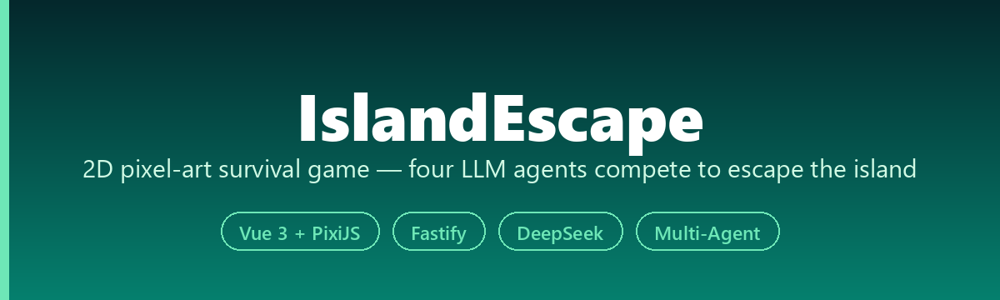
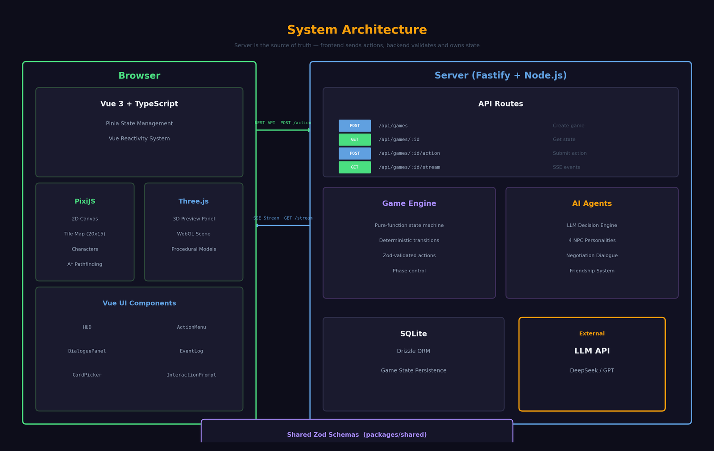
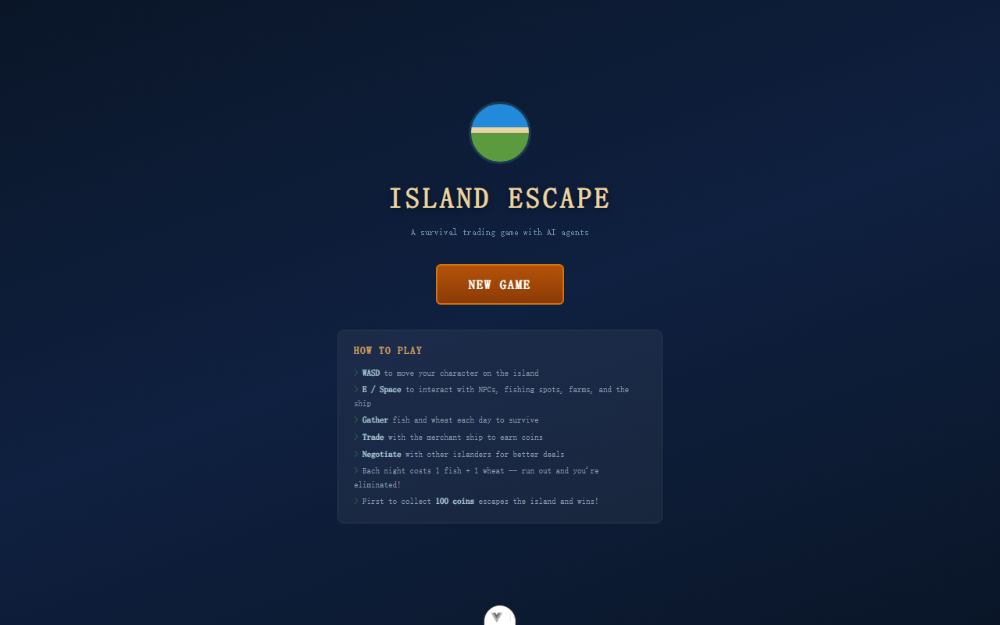
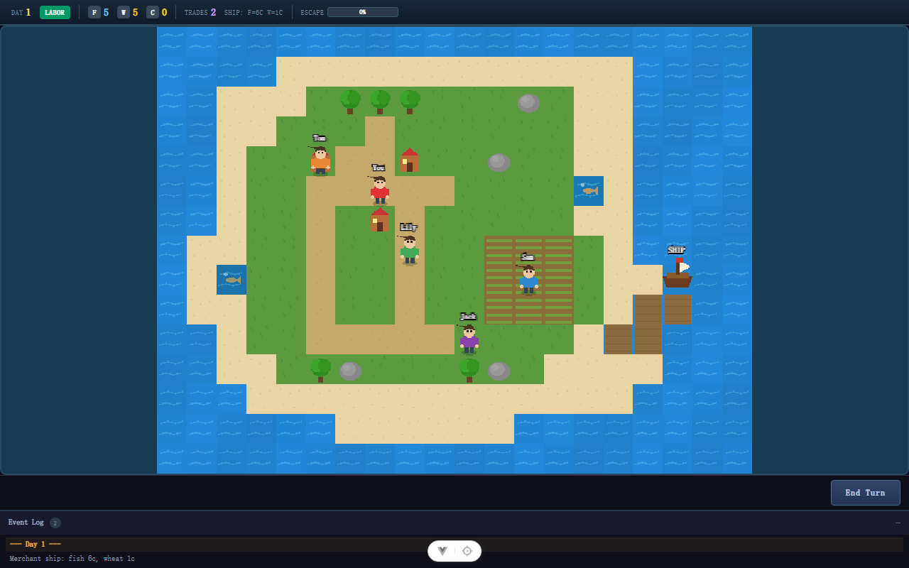

<div align="center">



[](LICENSE)
[](https://nodejs.org)

[**Quick Start**](#setup) · [**How to Play**](#how-to-play) · [**AI Agents**](#ai-personalities) · [中文](README_CN.md)

</div>

<p align="center"></p>

A 2D pixel-art survival trading game powered by LLM-based AI agents.

You're stranded on an island with four AI characters. Fish, farm, trade, and negotiate your way to 100 coins to escape — but everyone else is trying to do the same thing.

## Game Features

- **2D pixel-art island** — top-down tile map with WASD movement, rendered with PixiJS
- **LLM-powered AI agents** — each NPC has a distinct personality and negotiates trades in natural language via DeepSeek/OpenAI API
- **Labor + Trade system** — each day, every character must labor first (fish or farm), then gets 2 trade slots to negotiate with other islanders or sell to the merchant ship
- **Emergent social dynamics** — AI agents form alliances, drive hard bargains, and may refuse to trade with you if you're close to escaping
- **Friendship as currency** — successful trades build friendship, which affects pricing, willingness, and alliance formation

## Screenshots

### Title Screen



### Gameplay



## Tech Stack

| Layer | Technology |
|-------|-----------|
| Frontend | Vue 3 + TypeScript + Vite + Pinia + Tailwind CSS v4 |
| Game Rendering | PixiJS (HTML5 Canvas, programmatic pixel art) |
| Backend | Fastify + Zod + Drizzle ORM + SQLite |
| AI | OpenAI-compatible API (DeepSeek via OpenRouter) |
| Shared | Zod schemas for type-safe contracts across web/server |

## Project Structure

```
.
├── apps/
│   ├── web/                 # Vue 3 frontend with PixiJS game canvas
│   │   ├── src/game/        # PixiJS: tile map, characters, input, world
│   │   ├── src/components/  # Vue: HUD, ActionMenu, DialoguePanel, EventLog
│   │   ├── src/stores/      # Pinia game store + SSE management
│   │   └── src/composables/ # API helpers
│   └── server/              # Fastify backend
│       ├── src/engine/      # Game state machine (pure functions)
│       ├── src/agents/      # LLM integration: decision, negotiation, personalities
│       ├── src/routes/      # REST + SSE endpoints
│       └── src/db/          # Drizzle + SQLite persistence
└── packages/
    └── shared/              # Zod schemas shared between web and server
```

## Game Rules

### Daily Flow

1. **Day Start** — merchant ship arrives with random prices; pending harvests are collected
2. **Player Labor** (mandatory) — choose to fish (+3 fish instantly) or farm (+8 wheat in 3 days)
3. **Player Trade** (2 slots) — trade with merchant ship for coins, or negotiate with NPCs
4. **AI Turns** — each AI agent labors then uses up to 2 trade slots (LLM decides)
5. **Settlement** — everyone consumes 1 fish + 1 wheat; anyone at 0 is eliminated
6. **Win** — first to 100 coins boards the ship and escapes

### Trading

- **Merchant Ship**: sell fish/wheat at today's random prices for coins (only way to get coins)
- **Peer Negotiation**: walk to an NPC, initiate dialogue (max 5 exchanges), propose trades via templates or free text
- Each conversation costs 1 trade slot, whether or not a deal is reached

### AI Personalities

| Character | Personality | Play Style |
|-----------|------------|------------|
| **Tom** | Cautious Fisherman | Hoards resources, loyal to friends, drives hard bargains |
| **Sam** | Aggressive Trader | Flips resources for profit, charming but unreliable |
| **Lily** | Cooperative Farmer | Builds alliances, generous to friends, avoids conflict |
| **Jack** | Cunning Opportunist | Exploits desperate situations, pretends to be friendly |

## Setup

### Teacher / Demo Quick Start

If you received the source package directly, start here:

```bash
corepack enable pnpm
corepack use pnpm@latest-10
pnpm install
cp .env.example .env
pnpm dev
```

Then open http://localhost:5173 and click **NEW GAME**.

Before `pnpm dev`, edit `.env` and provide an OpenAI-compatible key. The
default configuration uses OpenRouter with `deepseek/deepseek-chat`:

```text
OPENAI_API_KEY=<your-openrouter-or-openai-key>
OPENAI_BASE_URL=https://openrouter.ai/api/v1
OPENAI_MODEL=deepseek/deepseek-chat
```

If NPC dialogue is slow, the game is waiting for the external model API. The
game state and resource rules are still validated by the backend.

For a production-style single-process run:

```bash
pnpm build
pnpm start
```

Set `HOST=0.0.0.0` and `PORT=<provider-port>` when deploying to a public Node
server. The Fastify server serves both `/api/*` and the built web app.

### Requirements

- Node.js >= 22.12
- pnpm (via Corepack)

### Install

```bash
corepack enable pnpm
corepack use pnpm@latest-10
git clone https://github.com/he-yufeng/IslandEscape.git
cd IslandEscape
pnpm install
```

### Configure

```bash
cp .env.example .env
```

Edit `.env`:

```
OPENAI_API_KEY=<your-openrouter-or-openai-key>
OPENAI_BASE_URL=https://openrouter.ai/api/v1
OPENAI_MODEL=deepseek/deepseek-chat
DB_FILE_NAME=file:local.db
LOG_LEVEL=info
```

### Run

```bash
pnpm dev
```

Opens:
- **Frontend**: http://localhost:5173
- **Backend**: http://localhost:8787

### Build

```bash
pnpm build
```

## How to Play

1. Open http://localhost:5173 and click **NEW GAME**
2. **WASD** to move your character on the island
3. **E** to interact — walk near fishing spots, farmland, NPCs, or the merchant ship
4. **Labor first**: fish or farm (mandatory each day)
5. **Then trade**: negotiate with NPCs or sell to the ship
6. Click **End Turn** when done — watch the AI agents take their turns
7. Survive the nightly resource drain and be the first to collect 100 coins!

## API Endpoints

| Method | Path | Description |
|--------|------|-------------|
| POST | `/api/games` | Create new game |
| GET | `/api/games/:id` | Get current game state |
| POST | `/api/games/:id/action` | Submit player action |
| GET | `/api/games/:id/stream` | SSE stream for real-time AI turn updates |

## Roadmap

The core loop — daily turns, trading, and LLM-driven NPCs — plays end to end. The next steps are about depth and reach:

- **Save and resume** — persist a run so a player can leave and come back, instead of starting fresh each session.
- **More NPC archetypes** — additional AI personalities with distinct trading behavior, so the island feels less repeatable across playthroughs.
- **A difficulty curve** — tune prices, events, and the escape goal across early and late game, so a run has more shape than a flat grind.
- **Local-model mode** — let NPC dialogue run against a local model (Ollama), so the game is playable without a hosted API key.

## References

- [Generative Agents (Park et al., 2023)](https://arxiv.org/abs/2304.03442) — foundational LLM agent architecture
- [Project Sid (2024)](https://arxiv.org/abs/2411.00114) — emergent economies in multi-agent simulations
- [AI Town (a16z)](https://github.com/a16z-infra/ai-town) — open-source LLM agent simulation

## License

MIT
