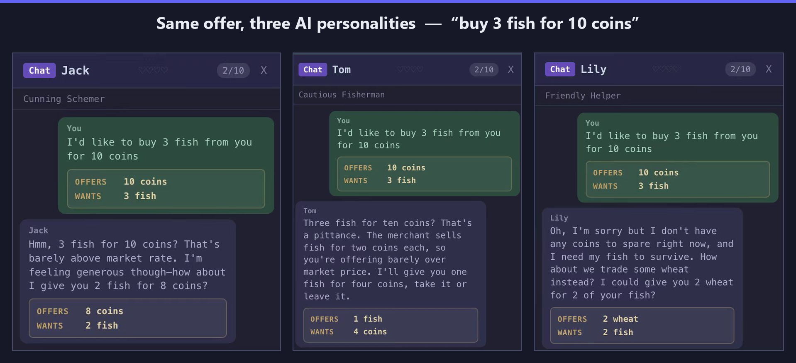
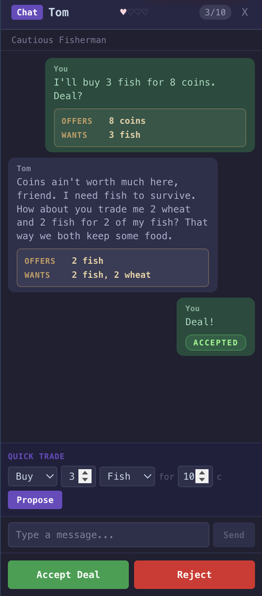
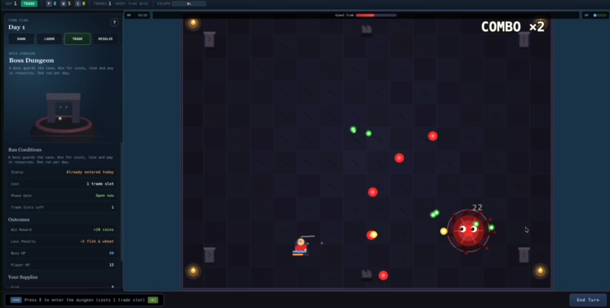
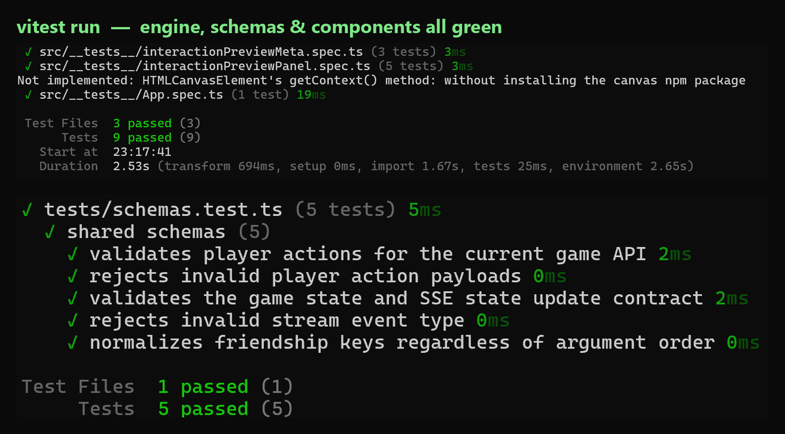

<div align="center">


[](LICENSE)
[](https://nodejs.org)
[](https://vuejs.org)
[](https://fastify.dev)

[**快速开始**](#快速开始) · [**核心想法**](#核心想法) · [**岛上的四个人**](#岛上的四个人) · [**架构**](#架构) · [English](README.md)

</div>

你漂到一座小岛上，岸边还有四个陌生人。所有人要的东西一模一样：凑够 100 枚金币、在粮食耗尽前买到离岛的船票。你捕鱼、种田、讨价还价，他们也一样。问题在于，另外四个幸存者都是大语言模型——它们会记仇、会结盟，还会在你只差一笔交易就要赢的时候，悄悄不再给你好价钱。

**IslandEscape** 是一款 2D 像素风生存交易游戏：每个 NPC 都由 LLM 驱动，而一个小而严谨的类型化游戏引擎负责把它们全都管住。


## 核心想法

大多数"游戏里的 AI"只是给 NPC 套个聊天机器人，然后祈祷模型别出戏。麻烦在于，模型会很乐意凭空变出自己没有的金币、答应一笔自己付不起的交易、或者三言两语就把自己"说赢"。一旦模型能直接动规则，整个经济系统就崩了。

所以 IslandEscape 把职责从中间劈开：

| LLM 负责 | 游戏引擎负责 |
|---|---|
| **意图** —— 这一回合这个 NPC 到底想要什么 | **资源** —— 每一枚金币、每一条鱼、每一单位小麦 |
| **对话** —— 用自然语言怎么把话说出来 | **阶段** —— 劳动、交易、结算、跨天 |
| **性格** —— 谨慎、激进、合作、狡猾 | **交易执行** —— 先校验这笔交易，再转移资源 |
| **谈判风格** —— 慷慨，还是一口回绝 | **胜负** —— 淘汰与逃离 |

模型提议，引擎裁决。NPC 想做的每一个动作，都是一个结构化提议，先用 [Zod](https://zod.dev) schema 校验，再决定要不要动一分一毫资源。模型一旦幻觉出一笔付不起的交易，引擎直接驳回，世界保持自洽。这就是整个项目立身的那句话：

> 模型负责表达，类型化的游戏引擎负责规则。

## 岛上的四个人

四个 NPC，四套 system prompt，四种完全不同的做生意方式。下面是它们面对**同一句**开场报价——"3 条鱼换 10 金币"——各自的反应：



| 角色 | 性格 | 怎么玩 |
|------|------|--------|
| **Tom** | 谨慎的渔夫 | 囤鱼，不信金币，交易压得很死——但一旦信任你就很忠诚 |
| **Sam** | 激进的商人 | 赚差价，嘴甜手快，不太靠得住 |
| **Lily** | 合作的农民 | 主动结盟，对朋友慷慨，宁可换货也不愿翻脸 |
| **Jack** | 狡猾的机会主义者 | 一眼看穿你的窘迫，笑着把你榨干，擅长放长线 |

好感度是真实状态，不是装饰文字。成功交易会抬高 NPC 对你的好感，进而影响它的报价、成交意愿，以及它愿意跟谁结盟。临到收尾还坑人一把，这座岛会记住。

## 一场谈判是怎么进行的

走到某个岛民身边，按 **E**，就进入对话。你可以用快捷交易模板，也可以直接打字说想要什么。每一轮往来都是一次真实的 LLM 调用：模型读取游戏状态、自己的性格、它和你的好感度、以及到目前为止的对话，然后给出一句回复加一个结构化提议，你可以接受、还价或拒绝。

<div align="center"></div>

```
你发消息  →  NPC 思考（LLM 调用）  →  NPC 回复 + 提议  →  接受 / 还价 / 拒绝
```

一场对话最多 5 轮，无论是否成交都要花掉 1 个交易槽——所以"开口"本身是有成本的。回来的提议从不轻信：先解析、再过 schema 校验，只有双方都付得起才真正执行。

## 每日循环

每一天，对你和每个 AI 都按固定阶段推进：

1. **白天开始** —— 商船带着今日随机价格到来，之前种下的田这时收成。
2. **劳动**（必须） —— 捕鱼立刻 **+3 鱼**，或种田换 **+8 小麦**（3 天后到账）。
3. **交易**（2 个槽） —— 卖给商船换金币，或跟岛民以物换物谈判。
4. **AI 回合** —— 四个 LLM 各自劳动，再自行决定怎么用掉自己的交易槽。
5. **结算** —— 所有人消耗 **1 鱼 + 1 小麦**，耗尽即淘汰。
6. **逃离** —— 率先凑够 **100 金币**登船获胜。

**关键数值**

| | |
|---|---|
| 初始物资 | 6 鱼 + 6 小麦 |
| 每晚消耗 | 1 鱼 + 1 小麦 |
| 捕鱼 | 每次劳动 +3 鱼 |
| 种田 | +8 小麦，3 天后到账 |
| 鱼价 | 2–6 金币（每日随机） |
| 麦价 | 1–4 金币（每日随机） |
| 交易槽 | 每天 2 个 |
| 胜利条件 | 100 金币 |

金币只能从商船获得，而商船只收鱼和小麦。正是这个唯一的瓶颈，把所有人逼到了谈判桌上。

## Boss 副本

通往金币还有一条更快也更险的路。每天你可以花 1 个交易槽进入副本，挑战 **巨蟹 Boss**——一个 150 HP、由状态机驱动的弹幕 Boss，分三个阶段步步升级：开场是四发瞄准弹，血量下降后加入旋转环形弹幕和召唤小怪，进入最后四分之一血量则打出八发齐射、更密的环形弹和更快的冲撞。Boss 还会随天数变强，越往后的挑战越硬。



- **进入：** 花 1 个交易槽，每天一次
- **赢：** +15 金币，存活越久奖励越高（上限 80）
- **输：** 最多 −5 鱼、−5 小麦（每样至少保留 1 个）
- **卡牌：** 命中积累经验，升级时从 3 张里选 1 张（多重射击、穿透、回血等，共 8 种）

它让每一天都变成一个真实的抉择：稳稳做市场，还是赌上今晚保命的资源，换一条更快的逃离捷径？

## 架构

服务端是唯一真相源。浏览器只发送 **动作**，后端校验、推进状态机，再通过 SSE 把结果流式推回。前端也好、LLM 也好，说什么都不算数，必须先过引擎这一关。


| 层次 | 技术 |
|------|------|
| 前端 | Vue 3 + TypeScript + Vite + Pinia + Tailwind CSS v4 |
| 2D 世界 | PixiJS —— HTML5 Canvas 上的地图、角色、A\* 寻路 |
| 3D 预览 | Three.js —— 角色/模型预览的 WebGL 场景 |
| 后端 | Fastify + Zod + Drizzle ORM + SQLite |
| 游戏引擎 | 纯函数状态机，转移过程全部 Zod 校验 |
| AI 智能体 | OpenAI 兼容 API（默认通过 OpenRouter 用 DeepSeek） |
| 共享 | `packages/shared` 里的 Zod schema，前后端共用一套契约 |

```
.
├── apps/
│   ├── web/                 # Vue 3 前端 + PixiJS 游戏画布
│   │   ├── src/game/        # PixiJS：地图、角色、输入、世界
│   │   ├── src/components/  # Vue：HUD、行动菜单、对话面板、事件日志
│   │   ├── src/stores/      # Pinia 游戏状态 + SSE 管理
│   │   └── src/composables/ # API 辅助函数
│   └── server/              # Fastify 后端
│       ├── src/engine/      # 游戏状态机（纯函数）
│       ├── src/agents/      # LLM 层：决策、谈判、角色性格
│       ├── src/routes/      # REST + SSE 端点
│       └── src/db/          # Drizzle + SQLite 持久化
└── packages/
    └── shared/              # 前后端共用的 Zod Schema
```

因为引擎就是一组作用在类型化状态上的纯函数，不调用任何模型也能完整测试。



```bash
pnpm test
```

## 快速开始

环境要求：**Node.js >= 22.12** 和 **pnpm**（通过 Corepack）。

```bash
corepack enable pnpm
corepack use pnpm@latest-10
git clone https://github.com/he-yufeng/IslandEscape.git
cd IslandEscape
pnpm install
cp .env.example .env
```

打开 `.env`，填入任意 OpenAI 兼容的 key。默认指向 OpenRouter 上的 DeepSeek，便宜、对游戏内对话也够快：

```
OPENAI_API_KEY=<你的 openrouter 或 openai key>
OPENAI_BASE_URL=https://openrouter.ai/api/v1
OPENAI_MODEL=deepseek/deepseek-chat
DB_FILE_NAME=file:local.db
LOG_LEVEL=info
```

然后运行：

```bash
pnpm dev
```

- **前端：** http://localhost:5173
- **后端：** http://localhost:8787

打开前端，点 **NEW GAME**，你就上岛了。如果 NPC 回复有点慢，那是模型 API 在思考——游戏状态和规则都在本地校验，始终保持正确。

生产模式单进程运行：`pnpm build && pnpm start`，Fastify 会同时服务 API 和构建后的前端；公网部署时设置 `HOST=0.0.0.0` 和 `PORT=<端口>`。

## 怎么玩

1. 打开 http://localhost:5173，点 **NEW GAME**。
2. **WASD** 在岛上移动。
3. **E** 互动 —— 捕鱼点、农田、商船或 NPC。
4. **先劳动**（捕鱼或种田），每天必须。
5. **再交易** —— 卖给商船，或走到岛民旁边谈判。
6. 点 **End Turn**，看四个 AI 各自行动。
7. 撑过每晚的消耗，率先凑够 100 金币。

## API 接口

| 方法 | 路径 | 说明 |
|------|------|------|
| POST | `/api/games` | 创建新游戏 |
| GET | `/api/games/:id` | 获取当前游戏状态 |
| POST | `/api/games/:id/action` | 提交玩家行动 |
| GET | `/api/games/:id/stream` | SSE 实时推送 AI 回合更新 |

## 后续规划

今天能完整玩通的，是整条循环：每日阶段、商船经济、LLM 驱动的谈判、Boss 副本、淘汰机制。下面是坦诚的局限和接下来的方向：

- **NPC 记忆** —— 智能体会基于当前状态和实时对话推理，但还没有跨多天的长期记忆。更深的记忆是让它们"更像活人"的最大杠杆。
- **经济 ↔ 副本平衡** —— 稳妥的市场路线和冒险的副本路线需要调校，别让任何一条压倒另一条。
- **节奏** —— LLM 延迟决定了回合的呼吸感；批处理和本地模型能让它更顺。
- **本地模型模式** —— 让 NPC 对话跑在本地模型（如 Ollama）上，没有云端 key 也能完整玩。
- **存档续玩** 与真正的**难度曲线**（前期/后期分别调校）。
- **实时多人** —— 这样能联手坑你的就不只是那几个 AI 了。

## 参考文献

- [Generative Agents (Park et al., 2023)](https://arxiv.org/abs/2304.03442) —— 可信的 LLM Agent 行为
- [Project Sid (2024)](https://arxiv.org/abs/2411.00114) —— 多 Agent 模拟中的涌现经济
- [AI Town (a16z)](https://github.com/a16z-infra/ai-town) —— 开源 LLM Agent 模拟

## 相关项目

IslandEscape 最初是个「怎么让 LLM 不作弊」的实验，下面几个也是我做的：

- **[CoreCoder](https://github.com/he-yufeng/CoreCoder)** — 想搞懂一个 coding agent 到底怎么运作？把整套约 1000 行引擎从头读到尾，而不是当黑箱。
- **[RepoWiki](https://github.com/he-yufeng/RepoWiki)** — 被丢进一个陌生代码库？它给你一份带「从哪读起」路径的 wiki，一个可自托管的 DeepWiki 替代。
- **[FindJobs-Agent](https://github.com/he-yufeng/FindJobs-Agent)** — 别再手动刷招聘网站：它按你的简历给岗位排序，还能跑模拟面试。
- **[agentcikit](https://github.com/he-yufeng/agentcikit)** — LLM agent 的 CI 安全层：回放运行、给工具调用上围栏、上线前分诊失败。

## License

MIT
